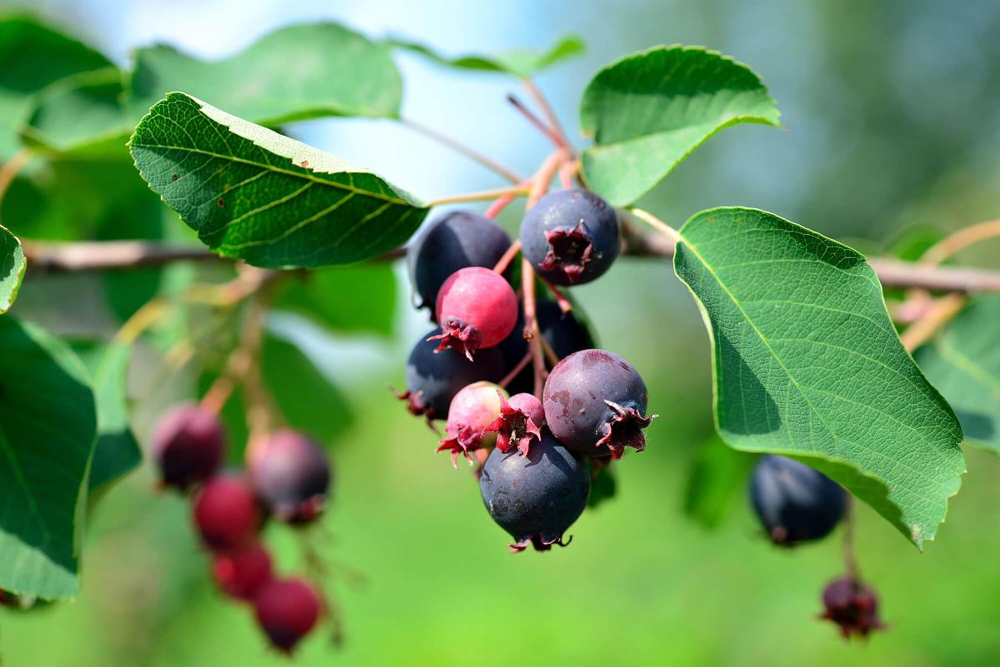

# Welcome!

  

<i> CWR Conservation in Canada </i> is an app that lets you identify the native range of CWRs
in Canada, and the extent of those species’ ranges that are conserved ex
situ in botanic gardens of Canadian CWRs. 

  

From the left navigation panel you'll be able to access the maps and data concerning the current status of CWR conservation in Canada. 

You can access the full data set of Canadian CWR 
[here](https://github.com/jensculrich/CWR_project/blob/main/all_garden_accessions_with_geo_data.csv).

This app has been made with [shiny](https://shiny.rstudio.com/) and you may
find the code on [github](https://github.com/jensculrich/CWR_Shiny).

